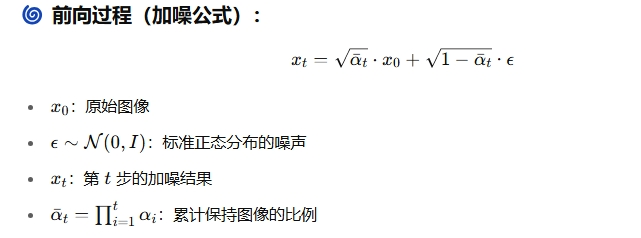
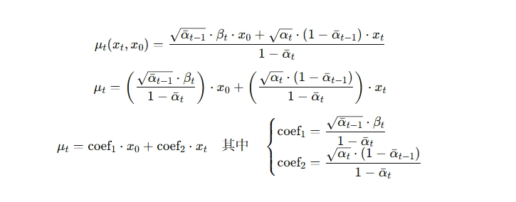
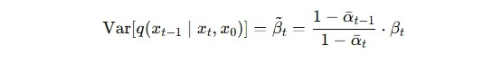
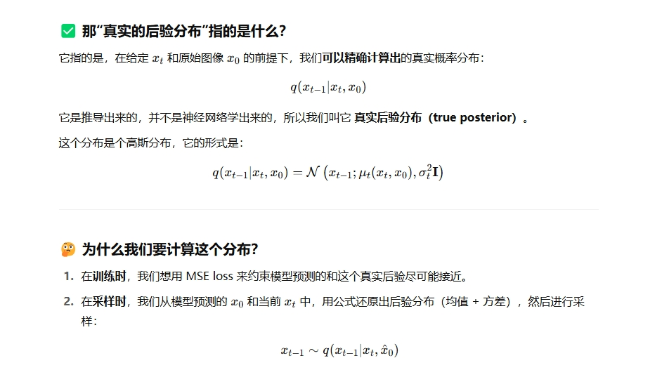
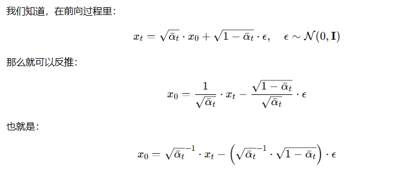
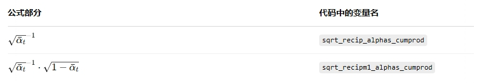

## 1. 构造函数 init

因为有关的计算都被我移动到了 noise_schedule 当中，所以构造函数看起来已经十分干净利索了。需要说明的只有：

```py
# noise_schedule 是一个包含和 beta 相关计算的值的字典
noise_schedule = get_noise_schedule(timesteps)
# 获取字典中的 键-值对，k-v
for k, v in noise_schedule.items():
    """
    setattr 是 Python 的一个内置函数，用来给对象动态地设置属性和值，
    因为这些值 v 需要在GPU上和图像做运算，所以使用 torch.from_numpy
    从 numpy 变为 tensor，同时转移给 device
    """
    setattr(self, k, torch.from_numpy(v).to(device))
```

## 2. 前向扩散相关函数

### 2.1 q_sample



```py
noise = torch.randn_like(x_start)
```

torch.randn_like(x_start) 的作用就是生成一张 与 x_start 形状一致 的高斯白噪声图像。

这个前向扩散的函数，虽然只调用执行一次，但 α、β 是整个时间序列。比如我们扩散步数为 1000 步，那么 get_noise_schedule 中的所有计算的数据，都是 1000 个值的一维数组。

所以在训练的时候，实际上是一次性，将 1000 张从原图到纯噪声的图像，全部都计算完毕了。

### 2.2 q_posterior

（1）真实后验均值



（2）真实后验方差



这些相关的参数都已经计算好了，posterior_mean_coef1，posterior_mean_coef2，posterior_variance，posterior_log_variance_clipped。

所有的 extract 调用只是为了让这些参数，符合当前批次图像的数量，以及图像的 Size，从而方便在 GPU 上和图像做运算。

真实后验分布，我刚开始很不理解为什么要这么叫，简单概括来说：

1. 它是根据我们定义的扩散过程精确可计算的；
2. 它是生成 x\_(t-1) 的最优理论分布，即我们理想中应该用的分布；
3. 但在实际中，我们只能近似它，比如通过网络预测的 x_0 来估算它，所以叫“真实”。

详细来说，请看图，我闭嘴：



### 2.3 p_losses

损失函数，它是在训练阶段使用的，所以我把它放在了前面。它很好理解，就是使用了均方误差（Mean Squared Error, MSE），来衡量

- q_sample 前向扩散过程中，经过加噪的所有图像
- model(x_t, t) 模型预测的噪音

两者之间的差异。

## 3. 逆向生成相关函数

### 3.1 predict_start_from_noise

通过当前时刻的图像 x_t 和模型预测的噪声 ε，推算出最初始图像 x_0 的估计值。

🌱 背后数学推导



🌸 相关的变量系数，同样也已经被计算好了



### 3.2 p_sample

采样的过程在函数中都已经注明了每一个步骤的作用，关于方差选择（ModelVarType.FIXED_LARGE）的部分在 ddpm-utils 中有说明。

### 3.3 p_sample_loop

这里需要着重说明一下。DDPM 所谓的去噪过程，并不等同于对一张图像进行复原，本质上是生成。

```py
x_t = torch.randn(shape, device=device)
```

从这个函数的第一行代码我们知道，最初的图像就是一个随机的符合高斯分布的白噪声。我做了实验，原本以为一张图像做训练的话，他应该能完美的复原出原本的图像吧，很遗憾它不能。

回顾一下，DDPM 叫做**去噪扩散==概率==模型**，DDPM 不学习图像，它学习==分布==。在 DDPM 里，模型的目标是学习如何从高斯噪声一步步还原出一个真实图像分布的样本。它不在乎一张图像具体是什么，而在于：

1. “一张好图像通常长什么样”
2. “像素怎么组合才是合理的”
3. “有前景就该有背景，有轮廓就该有纹理”

一张图像只是一个点，而模型学习的是点的分布。你给它一张图，那分布就变成了一个点 —> 模型只看到一种可能，没有统计意义。

🔬 **从视觉理解一张图难以训练的现象**

我们脑补一下模型是怎么学习的。你给它一张图，然后说“你要学会从随机噪声生成它”，模型就会问：

- 「哪里是人脸？哪里是背景？」
- 「人脸应该多大？鼻子在哪个位置？」
- 「眼睛是圆的？椭圆的？背景是白的吗？」

但由于它 只看到一张图，它就不知道哪些是偶然的，哪些是必然的。于是模型产生幻觉：“哦，原来图像就是噪声... 我能生成一堆！”

```py
# 采样不是训练，不用计算梯度，减少资源消耗
with torch.no_grad():
    # 对加噪的时间步数组进行逆序操作，从 1000 -> 0
    for i in reversed(range(self.timesteps)):
        # 对每一个时间步进行形状扩充，shape[0] 表示 [B]，batch size
        # 同时转化为 tensor，以便在 p_sample 中和 x_t 一起送入模型
        t = torch.full((shape[0],), i, device=device, dtype=torch.long)
        x_t = self.p_sample(model, x_t, t)
```

### 3.4 sample

这个函数更好理解了，封装了 p_sample_loop，用于外部调用。
