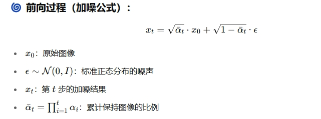

## 1. linear_beta_schedule

线性加噪计划：获取对应扩散步数的 β (beta) 噪声强度。DDPM 原文中，使用了 1000 步，对应的 beta 值从 0.0001 线性增大到 0.02。

np.linspace(start, end, steps) 函数可以获取一个线性的序列数组，设置对应的起始值 start，结束值 end，然后设置步长 steps，即起始值和结束值之间一共有多少步，他就可以自动计算并填充成一个 np 的数组，比如：

```py
import numpy as np
arr = np.linspace(1, 100, 10)
print(arr)

# 输出
[  1.  12.  23.  34.  45.  56.  67.  78.  89. 100.]
```

在这里呢，我参考了 IDM 的步数缩放机制，比如有些人可能想快速迭代看看结果，设置个 timestep=500；有些人想增加扩散步数 timestep=2000，让逆向生成的过程更加细腻。通过 scale 的缩放，让线性加噪方案变得更加灵活。

## 2. get_noise_schedule

获取加噪方案：这里原本只是获取 beta 数组的一个 API 接口，但是我将原本放在 diffusion 模块中的计算搬到了这里，因为这些关于 beta 的需要被计算的数据，只跟 beta 有关，在 beta 数组确定之后，其余的计算同样也能够确定下来。

### 2.1 计算的表达式

| 代码名称                       | 数学表达式                      |
| ------------------------------ | ------------------------------- |
| betas                          | 噪声时间表 βₜ                   |
| alphas                         | 1 - βₜ                          |
| alphas_cumprod                 | ᾱₜ                              |
| alphas_cumprod_prev            | ᾱₜ₋₁                            |
| alphas_cumprod_next            | ᾱₜ₊₁                            |
| sqrt_alphas_cumprod            | √ᾱₜ                             |
| sqrt_one_minus_alphas_cumprod  | √(1 - ᾱₜ)                       |
| log_one_minus_alphas_cumprod   | log(1 - ᾱₜ)                     |
| sqrt_recip_alphas_cumprod      | √(1 / ᾱₜ)                       |
| sqrt_recipm1_alphas_cumprod    | √(1 / ᾱₜ - 1)                   |
| posterior_variance             | βₜ × (1 - ᾱₜ₋₁) / (1 - ᾱₜ)      |
| posterior_log_variance_clipped | log(max(posterior_variance, ε)) |
| posterior_mean_coef1           | βₜ × √(ᾱₜ₋₁) / (1 - ᾱₜ)         |
| posterior_mean_coef2           | (1 - ᾱₜ₋₁) × √(αₜ) / (1 - ᾱₜ)   |

这些预先计算好的数值数组，其实就是对 DDPM 论文中的几个公式的拆解，比如前向扩散过程中的加噪公式：



### 2.2 nunpy 中的函数

- np.cumprod(a, axis): 按给定轴计算累积乘积（从左到右依次乘起来），axis 默认为 0 或者 None，即在一维扁平化数据上进行计算。

```py
np.cumprod([1, 2, 3, 4])
# 输出: [1, 2, 6, 24]
```

- np.append(arr, values, axis): 在数组末尾追加值（不会就地修改，返回新数组），arr 为原始数组，values 要追加的数组或值。

```py
np.append([1, 2, 3], [4, 5])
# 输出: [1, 2, 3, 4, 5]
```

- np.sqrt(x): 逐元素开平方，x 为输入的数组或数字

```py
np.sqrt([4, 9, 16])
# 输出: [2., 3., 4.]
```

- np.log(x): 逐元素计算自然对数（以 e 为底），x 必须 > 0

```py
np.log([1, np.e, np.e**2])
# 输出: [0., 1., 2.]
```
