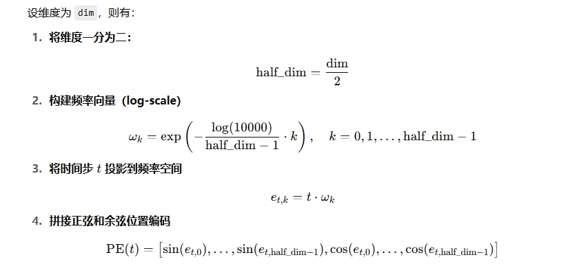
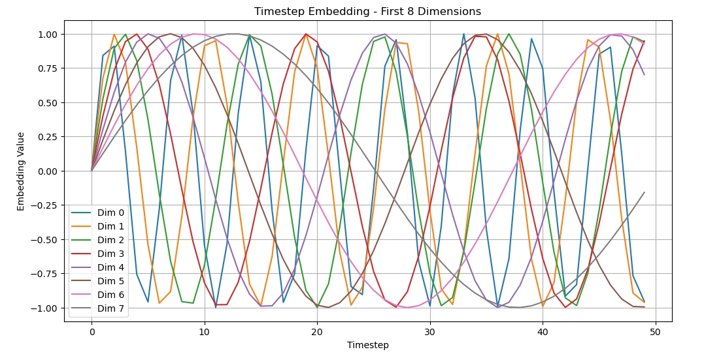

## 1. timestep_embedding

这个函数非常非常重要了，因为现在所使用的网络模型，网络层都是卷积层，也叫空间卷积，它对时间是没有概念的。而模型之所以有一个比较好的噪声预测能力，是因为==时间步嵌入==，也就是这个函数，显式的告诉了每一步的模型，你现在走到哪了。

这个函数的核心思想，其实和 Transformer 中的位置编码（Positional Encoding）非常类似：

它做的事是将离散的时间步（整数）t 映射成一个连续的高维向量表示 t_emb，使模型能感知 “当前在第几步”。

💡 为什么要这样设计？

- 不同维度对应不同频率，能编码“细节”和“粗略”的时间感知；
- sin + cos 双通道可以让模型有更多组合可能；
- 它是无参数的，相比 learnable embedding 更稳定、通用。

在我写的三个 U-Net 模型中，嵌入的维度 dim 基本上都是 base_channel=64。这里截取了 timesteps=[0, 50]，以及前 8 个维度的可视化数据：

1. 多条曲线以不同频率震荡；
2. 靠前的维度频率高，震荡快，波长短；靠后的维度频率低，震荡慢，波长长；
3. sin / cos 交错的特性，在嵌入后提供周期性与唯一性。
