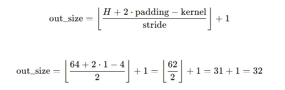
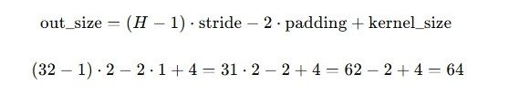

## 1. 主类 SimpleUNet

### 1.1 时间步嵌入和线性变换

```py
# 构造函数 init 中
time_emb_dim = base_channels * 4
self.time_embedding = nn.Sequential(...)

# forward 中
t_emb = timestep_embedding(t, self.base_channels).to(x.device)
t_emb = self.time_embedding(t_emb)
```

第一步，将时间步通过 timestep_embedding 编码成正余弦高维表示，是为了让模型在走卷积时，知道自己走到哪了。然后通过一个 time_embedding 走两层线性变换，是为了提升时间表示的表达能力，知道自己该干什么。

这么说真的非常的抽象，我们举个例子。想象一下，我们的时间步 t 是一个整数，比如 37，这就像你手里拿着一张纸条，写着："今天是扩散的第 37 步"。

但是神经网络是不懂这个“37”的含义的，它要理解这个“时间概念”，就像你要把“第 37 天的状态”翻译成一段可理解的语言，告诉网络：“哦，我现在处于一个中期阶段，噪声不是很大也不是很小，我需要开始还原图像的一些细节了……”。

💡 那我们是怎么翻译的呢？上述流程是这样的，我们一共做了三件事：

```py
SinusoidalEmbedding → Linear(64 → 256) → ReLU → Linear(256 → 256)
```

**1. 用正弦函数将整数 t 编码成一个“频率空间”里的向量（Sinusoidal）**：就像你在不同频率上测了一下“第 37 天”的反应，这让网络可以区分不同时间步。

**2. 第一层 Linear + ReLU：映射成一个“时间语义空间”**：就像你请了一个翻译，把“频率向量”变成了一段有意义的描述，比如“第 37 天大致处于收尾阶段”。

**3. 第二层 Linear：精细调一下语气和句式**:就像你在润色那段话，让不同层的网络能听懂，比如卷积网络能理解这个时间含义。

如果我们不用 ReLU、只用一个线性层：那得到的时间嵌入只是一个“线性映射”，它只是换了个坐标系，但它本质的信息没有太多变化。但是加了 ReLU，相当于加了一个 非线性拐点，它可以让高维空间中的不同时间步之间的“语义差异”更明显，能区分出 0 步、128 步和 999 步这几种截然不同的状态。

就好像你一开始只说了：“今天第 37 天”。最后却变成了：“今天是第 37 天，意味着图像该开始细化了，请将边缘锐化并降低背景噪声”。这就是所谓的 ==提升时间嵌入的表达能力==。

### 1.2 输入层和输出层

```py
# 构造函数 init 中
self.input_conv = nn.Conv2d(in_channels, base_channels, 3, padding=1)
self.output_conv = nn.Sequential(...)

# forward 中
h = self.input_conv(x)
return self.output_conv(h)
```

在上采样和下采样中，我们设置了通道数增加的倍率（也是图像缩小的倍率）：channel_mults=(1, 2, 4)。同时我们也设置了，基础的通道数 base_channels=64，但是我们的输入通道数是 3，对于第一次下采样的倍率 1 来说，64 != 3，所以我们做了一个输入的卷积，将其提升至 64 维。

输出的设定就有意思了：GroupNorm → SiLU → Conv2d

1. 在 U-Net 这种结构中，解码（上采样）后得到的特征图会有很多不均衡的值，比如有的区域特别激活、有的没啥信号。如果直接输出，可能导致图像不稳定、有偏差。GroupNorm(32, ch) 可以理解为：

   - 将通道按组切开（比如 64 个通道分成 2 组，每组 32 个）
   - 每组单独标准化，平衡各组的数值范围。
   - 对小 batch 更稳定，适合生成任务（比 BatchNorm 更可靠）

2. SiLU（Swish）是：x \* sigmoid(x)。相比 ReLU 更平滑，在生成任务中常见，因为它：

   - 不会完全抛弃负值（不像 ReLU 截断）
   - 在训练后期，能让输出更细腻

3. Conv2d 输出 RGB：结合所有特征，生成三通道图像。

拿做饭来比喻，如果直接卷积输出，就像 Unet2 中的操作一样：“直接一锅端”。但是按照现在这个步骤来做，相当于是：🧂 加点调味料（归一化），🔥 精细加热（激活函数），🍽️ 再装盘（最后卷积输出）。优雅美味。

最后，forward 函数中的 h，它就是每一步进行操作的对象。

### 1.3 下采样和上采样

这部分的代码比较多，就不贴了，简单讲一下，我们有 2 个残差块，3 个通道缩放倍率，skip_channels 用来保存每一次的通道数变换，如果把下采样阶段，平铺的写成 ModuleList 的形式：

```py
self.down_blocks = nn.ModuleList([
    # level 0
    ResidualBlock(64, 64, time_emb_dim),  # 第一个ResBlock
    ResidualBlock(64, 64, time_emb_dim),  # 第二个ResBlock
    Downsample(64),                       # 下采样

    # level 1
    ResidualBlock(64, 128, time_emb_dim), # 通道数变换 + 时间融合
    ResidualBlock(128, 128, time_emb_dim),# 保持通道数
    Downsample(128),                      # 只减小空间尺寸，也就是图像 Size

    # level 2（最后一层，不加 Downsample）
    ResidualBlock(128, 256, time_emb_dim),
    ResidualBlock(256, 256, time_emb_dim),
])
skip_channels = [64, 64, 128, 128, 256, 256]
```

不知道有没有一些小白道友，和我刚开始一样懵逼，为什么下采样的时候通道数是保持一致的？这是因为 U-Net 的设计思想里，模块功能是“解耦的”：Downsample 专注做“空间尺寸缩小”，而不是处理通道变化。

| 模块          | 主要作用             |
| ------------- | -------------------- |
| ResidualBlock | 提取特征 + 通道转换  |
| Downsample    | 缩小空间尺寸（H, W） |
| Upsample      | 放大空间尺寸（H, W） |

虽然有些论文里确实会在 downsample 的同时升通道，那是为了减少参数、减少显存，不过 可解释性和模块化性会下降，不如目前这种清晰的结构。

其余的，上采样，跳跃连接，特征叠加还是需要讲一讲的。同理，上采样的平铺形式为：

```py
skip_channels = [64, 64, 128, 128, 256, 256]
self.up_blocks = nn.ModuleList([
    # Level 2: mult = 4 → out_ch = 256
    ResidualBlock(256 + skip_channels.pop(), 256, time_emb_dim),
    ResidualBlock(256 + skip_channels.pop(), 256, time_emb_dim),
    Upsample(256),

    # Level 1: mult = 2 → out_ch = 128
    ResidualBlock(256 + skip_channels.pop(), 128, time_emb_dim),
    ResidualBlock(128 + skip_channels.pop(), 128, time_emb_dim),
    Upsample(128),

    # Level 0: mult = 1 → out_ch = 64
    ResidualBlock(128 + skip_channels.pop(), 64, time_emb_dim),
    ResidualBlock(64 + skip_channels.pop(), 64, time_emb_dim),
    # 🚫 no Upsample here
])
```

这里为什么要加 skip_channels.pop()，就是为了==跳跃连接，特征叠加==：

- 🔽 下采样的时候：我们只是一路走到底，不断缩小图像空间尺寸，把图像从 64x64 → 32x32 → 16x16...

- 🔼 上采样的时候：我们要一边恢复空间尺寸，一边把之前细节补回来，所以用上了跳跃连接（skip connection）

很好理解对吧，我们在缩小图像的时候，能够保留大致的主体信息，但是细节都已经丢失掉了。所以在下采样的过程中，每一步都会叠加上一步的特征，这是为了防止特征变的过于抽象。

而在上采样的过程中，我们要把保留下来的细节特征，在不同的 size 层中叠加上去，逐步恢复原始尺寸图像的全部特征。所以特征叠加是下采样和上采样都有做的事情，但是上采样时采用的是跳跃连接的方式。

真正的实现是在 forward 函数中完成的：

```py
# 下采样的时候，通过 hs 列表保存叠加过的特征信息
hs = [h]
h = module(h, t_emb)
hs.append(h)

# 上采样的时候，增加特征信息，并对齐通道数（结构中的skip_channels.pop()）
h = torch.cat([h, hs.pop()], dim=1)
h = module(h, t_emb)
```

### 1.4 中间层处理

在经典的 U-Net 和很多扩散模型（包括 DDPM）结构中，中间层（也叫 bottleneck 或 bridge）通常会是 两个 ResidualBlock：

```py
self.middle_block1 = ResidualBlock(ch, ch, time_emb_dim)
self.middle_block2 = ResidualBlock(ch, ch, time_emb_dim)
```

我总结了一下，大致有三点原因：经验主义、信息融合、对称结构。

**1. 经验主义**：原始 U-Net、ResNet 中间部分几乎都不止一个模块；而 DDPM 的参考实现（包括 IDM、Latent-Diffusion）也都在中间用了多个 ResBlock；甚至有一些论文还会加入 Cross Attention、Transformer Block 等额外模块，说明中间层是可以、或者说应该被加深的。

**2. 信息融合**：中间层是全网络中感受野最大、抽象程度最高的部分，经过了多轮卷积和池化后的全局表示就浓缩在这里。用两个 block 可以更充分地进行抽象特征的融合，避免单个 block 学不到足够多的信息（尤其在大模型或复杂任务中）。

**3. 对称结构**：下采样部分，每一层有两个 ResidualBlock；上采样部分，每一层也有两个 ResidualBlock；中间部分，作为“压缩”与“还原”的交界点，也来两个，是一种结构对齐和信息桥梁的体现。

## 2. 下采样 Downsample

```py
# 更常见于 U-Net 和 Diffusion 里，信息保留得更细腻一些。
self.op = nn.Conv2d(channels, channels, 3, stride=2, padding=1)

# 用于图像尺寸为偶数的情况，能精准缩小1倍，但边界更“硬”
self.op = nn.Conv2d(channels, channels, 4, stride=2, padding=1)
```

先看一下计算的公式举例：



- kernel=3, stride=2, padding=1 是一种 更平滑、过渡自然 的方式，不会产生明显的 block artifact（块状伪影），常用于图像生成任务中。
- kernel=4, stride=2, padding=1 是 常见的“精确下采样”卷积方式（比如 DCGAN 就用这个）。

## 3. 上采样 Upsample

```py
self.op = nn.ConvTranspose2d(channels, channels, 4, stride=2, padding=1)
```

Conv2d 是压缩结构，它天然会把相邻像素压进一个格子里。而 ConvTranspose2d 是一种 可学习的上采样方法，比简单的 Upsample 更强大（比如 nn.Upsample(mode="nearest") 就很笨）。

ConvTranspose2d 能变大的原理是：它是转置卷积，也叫反卷积（deconvolution）：

1. 它的本质是：先在输入之间插入 0，再用普通卷积滑过去
2. 插进去的 0 会被卷积核「学习着填满」
3. 所以它的输出图像更大，信息也更丰富
4. 比起 nn.Upsample，它能让模型自己决定插什么值，而不是死板地复制/插值

而这里的卷积核为什么是 4，是因为卷积公式不一样：



## 4. 残差块 ResidualBlock

大多数的结构都已经在前面讲过了，归一化、激活函数、卷积层等等。讲一下 self.skip：

```py
if in_channels != out_channels:
   self.skip = nn.Conv2d(in_channels, out_channels, 1)
else:
   self.skip = nn.Identity()  # Identity 表示什么都不变，相当于占位符
```

这是用作叠加特征信息的前置条件，ResidualBlock 总共做了三件事，通道数变换 + 时间融合 + 特征叠加。在叠加上一次图像特征时，可能会遇到通道数变化了的情况，所以需要用一个卷积，对齐通道数。

```py
# x 归一化 -> 激活函数 -> 卷积
h = self.conv1(self.activation(self.norm1(x)))
# 嵌入的时间步 t_emb，先通过 time_emb_proj 对齐通道数，再广播成一致的形状
h += self.time_emb_proj(t_emb)[:, :, None, None]
# dropout=0.1 表示稍微丢失一点神经元（通道数），提高泛化能力，防止模型太依赖某一部分特征
h = self.conv2(self.dropout(self.activation(self.norm2(h))))
# 当前处理后的图像 h 叠加上一次图像 x 的特征
return h + self.skip(x)
```
